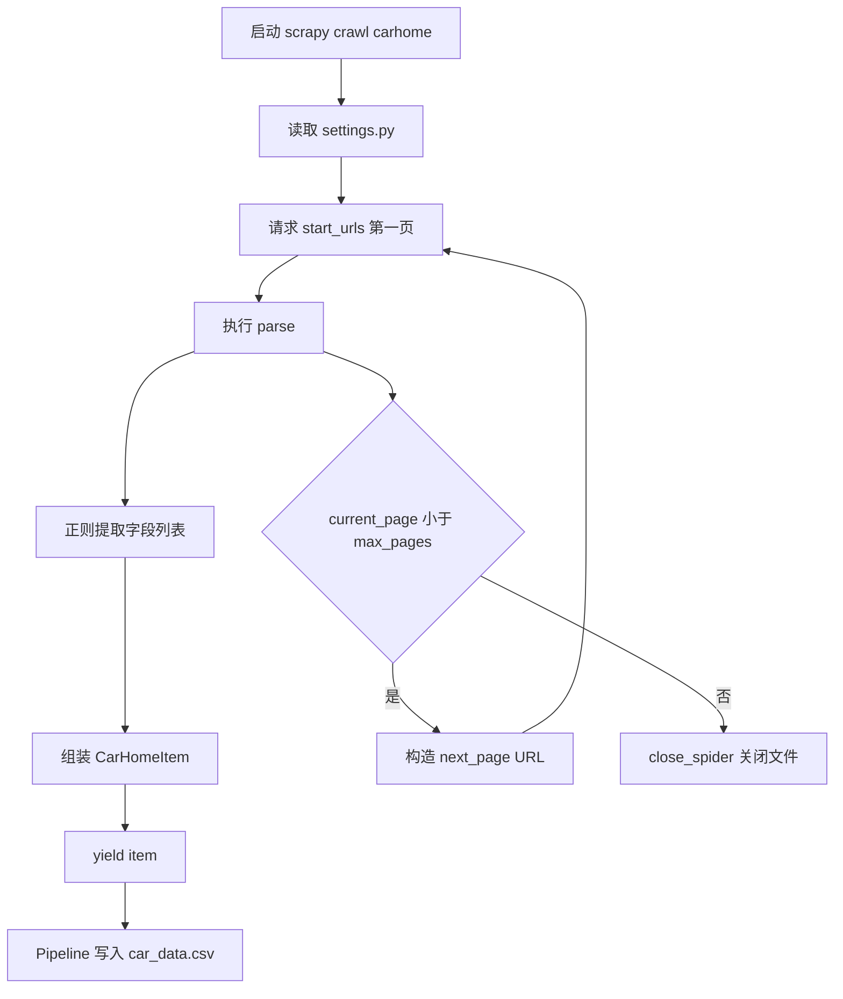
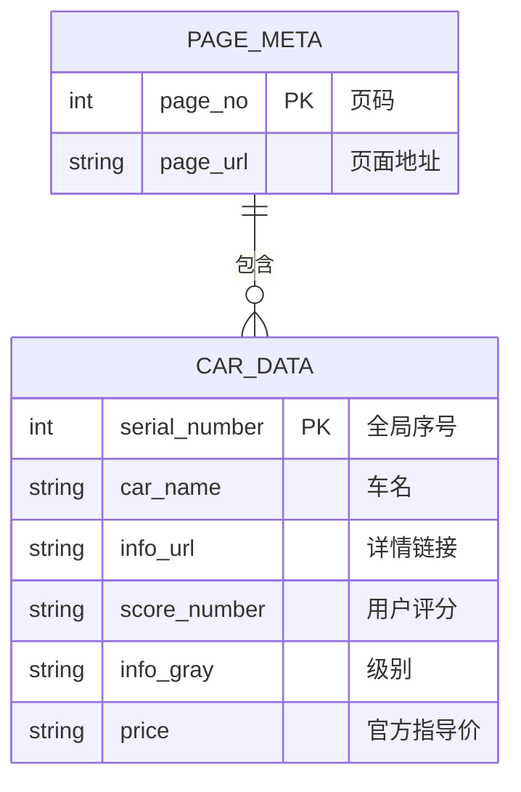
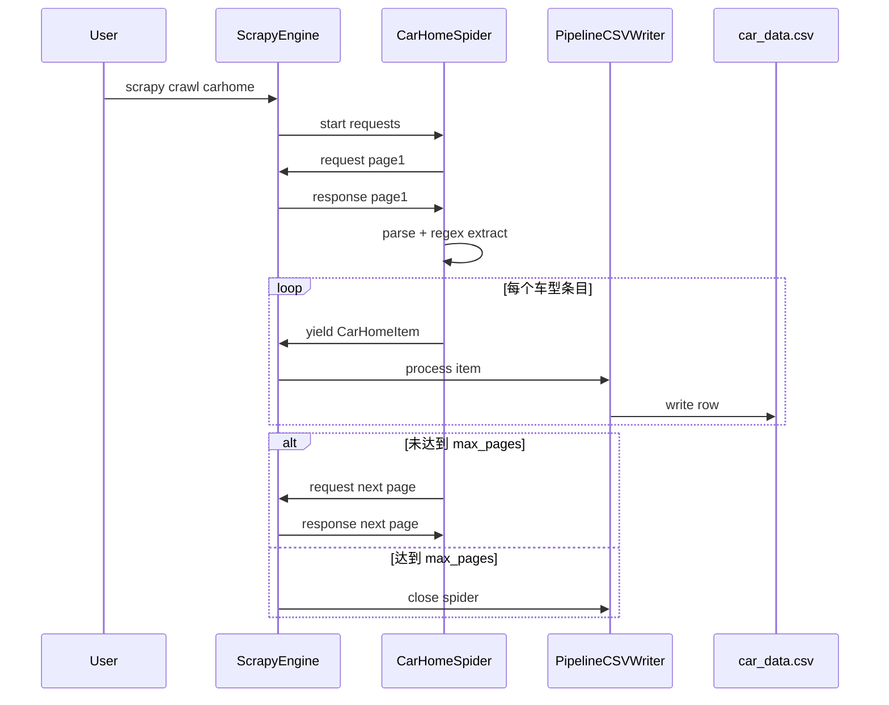
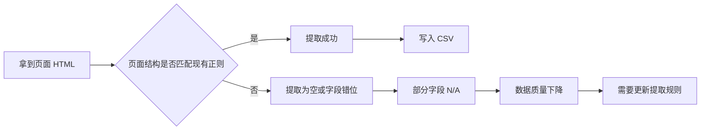
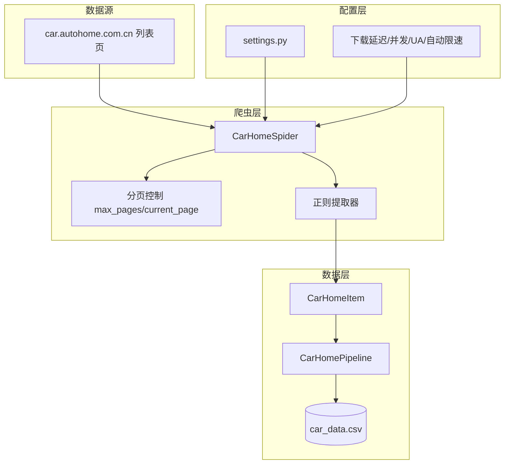
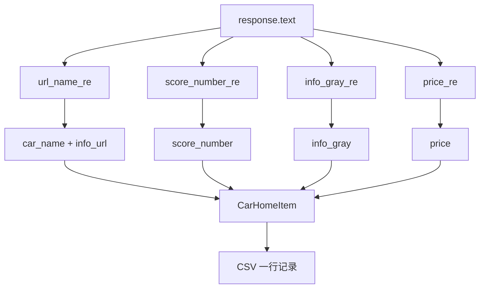
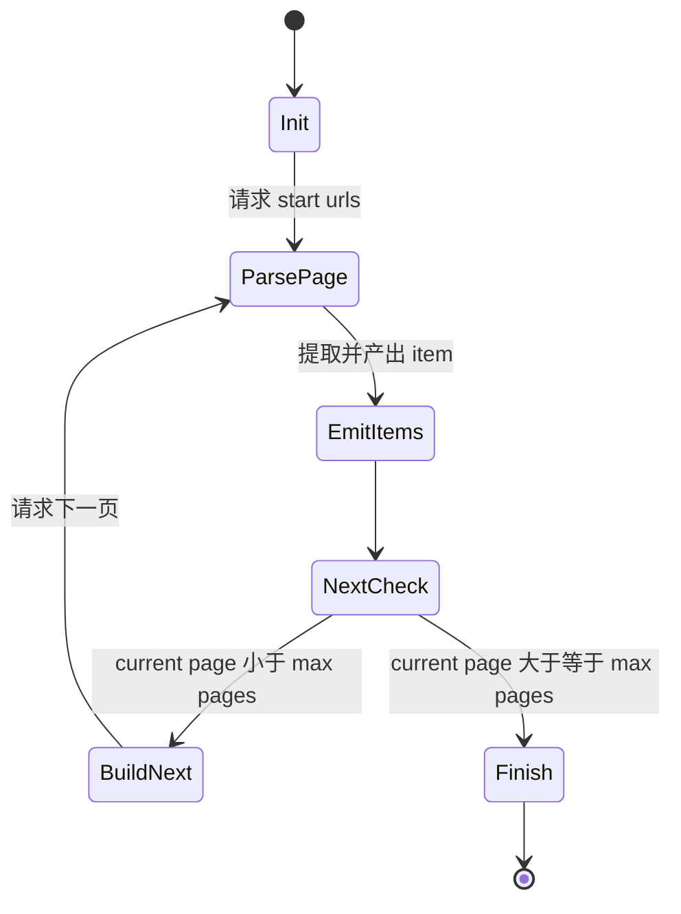

# Carhomespider-scrapy（汽车之家车型信息爬虫）

> 这是一个基于 Scrapy 的入门级爬虫项目：从汽车之家车型列表页抓取基础字段，并保存为 CSV 文件。

---

## 1. 项目做什么、怎么做（含逐步执行命令）

### 1.1 这个项目做什么

这个项目会从汽车之家车型列表页采集以下字段：

- 序号（全局递增）
- 车名
- 车型详情链接
- 用户评分
- 级别
- 官方指导价

最终输出到：`carhome_scraper/car_data.csv`

---

### 1.2 你只想“直接跑起来”的最短步骤

> 下面命令是从 0 到跑通的最短路径，按顺序执行即可。

#### 第 0 步：进入项目目录

```bash
cd /Users/apple/Documents/PyCharm/Carhomespider-scrapy
```

#### 第 1 步：创建虚拟环境（推荐）

```bash
python3 -m venv .venv
```

#### 第 2 步：激活虚拟环境

macOS / Linux:

```bash
source .venv/bin/activate
```

Windows（PowerShell）:

```powershell
.venv\Scripts\Activate.ps1
```

#### 第 3 步：安装依赖

```bash
pip install -U pip scrapy
```

如果网络慢可用清华镜像：

```bash
pip install -U pip scrapy -i https://pypi.tuna.tsinghua.edu.cn/simple
```

#### 第 4 步：进入 Scrapy 工程目录

```bash
cd carhome_scraper
```

#### 第 5 步：运行爬虫

```bash
scrapy crawl carhome
```

#### 第 6 步：查看结果文件

```bash
ls -lh car_data.csv
```

查看前 20 行：

```bash
head -n 20 car_data.csv
```

---

### 1.3 目录结构（你看到什么文件、分别干什么）

```text
Carhomespider-scrapy/
├── README.md
└── carhome_scraper/
    ├── scrapy.cfg
    ├── car_data.csv                 # 运行后生成（或覆盖）
    └── carhome_scraper/
        ├── __init__.py
        ├── items.py                 # 定义采集字段
        ├── middlewares.py           # Scrapy 中间件模板
        ├── pipelines.py             # 将 Item 写入 CSV
        ├── settings.py              # 爬虫配置（延迟、并发、UA 等）
        └── spiders/
            ├── __init__.py
            └── carhome.py           # 主爬虫逻辑
```

---

### 1.4 运行时到底发生了什么（按时间顺序）

1. Scrapy 加载 `settings.py`。
2. 启动 `carhome` 爬虫，从 `start_urls` 第一页开始。
3. 在 `parse()` 里用正则从 HTML 中抽取字段。
4. 组装成 `CarHomeItem`，逐条 `yield`。
5. `CarHomePipeline` 接收 item，写入 `car_data.csv`。
6. 若未到 `max_pages`，构造下一页 URL，继续请求。
7. 完成后关闭文件句柄，爬虫退出。

---

### 1.5 常用命令大全（复制即用）

进入工程：

```bash
cd /Users/apple/Documents/PyCharm/Carhomespider-scrapy/carhome_scraper
```

正常运行：

```bash
scrapy crawl carhome
```

看详细日志：

```bash
scrapy crawl carhome --loglevel DEBUG
```

输出到 JSON（Scrapy 内置导出）：

```bash
scrapy crawl carhome -o output.json
```

输出到 CSV（Scrapy 内置导出）：

```bash
scrapy crawl carhome -o output.csv
```

只检查 Scrapy 配置是否生效：

```bash
scrapy settings --get BOT_NAME
scrapy settings --get DOWNLOAD_DELAY
scrapy settings --get ITEM_PIPELINES
```

---

### 1.6 你最容易遇到的问题（新手版）

#### 问题 A：`scrapy: command not found`

原因：没安装 Scrapy，或虚拟环境没激活。  
解决：先 `source .venv/bin/activate`，再 `pip install scrapy`。

#### 问题 B：运行后没有数据

排查顺序：

1. 先看日志是否请求成功（状态码 200）。
2. 网站 HTML 结构可能变化，导致正则失效。
3. 打开 `spiders/carhome.py`，检查正则是否还能匹配到目标字段。

#### 问题 C：CSV 中文乱码

本项目已经用 `utf-8` 写入；如果 Excel 打开乱码，优先用支持 UTF-8 的工具（如 VSCode、Numbers、Pandas）查看。

---

## 2. 技术栈（语言、库、工程风格）

### 2.1 语言与运行环境

- Python 3
- Scrapy 项目结构

### 2.2 核心库

- `scrapy`：爬虫框架（请求调度、解析、管道）
- `re`：正则表达式提取字段
- `csv`：标准库 CSV 写文件

### 2.3 工程风格

- 单爬虫、单 pipeline 的轻量结构
- `Item` 明确字段，`Pipeline` 统一落盘
- 配置集中在 `settings.py`
- 以“能快速跑通”为目标的教学/课程项目风格

### 2.4 关键配置（当前项目）

- `DOWNLOAD_DELAY = 2`：每次请求间隔 2 秒
- `CONCURRENT_REQUESTS = 16`：并发请求上限
- `AUTOTHROTTLE_ENABLED = True`：自动限速
- `ROBOTSTXT_OBEY = False`：不按 robots.txt 限制
- `ITEM_PIPELINES` 启用 `CarHomePipeline`

---

## 3. 算法及数学模型

### 3.1 抽取算法（当前实现）

当前实现属于：

- **规则驱动提取**（Rule-based Extraction）
- 基于 HTML 文本 + 正则匹配

主要步骤：

1. 请求列表页 HTML。
2. 用 4 组正则分别抽取：车名/链接参数、评分、级别、价格。
3. 通过索引对齐不同字段列表。
4. 超出字段长度时填充 `N/A`（防止越界）。
5. 逐条写入 CSV。

### 3.2 分页策略模型

设：

- 最大页数 `P = max_pages`
- 每页最多采集条数 `K = items_per_page`

理论最大采集量：

$$
N_{max} = P \times K
$$

当前代码默认：

- `P = 10`
- `K = 15`

所以理论上限：

$$
N_{max} = 10 \times 15 = 150
$$

> 实际条数可能小于 150（比如某页展示不足 15 条、字段缺失等）。

### 3.3 时间复杂度（粗略）

设每页 HTML 长度为 `L`，页数为 `P`。

- 每页进行若干正则扫描，可近似看作 `O(L)` 级别常数倍。
- 总体约为 `O(P * L)`。

CSV 写入是线性的，记作 `O(N)`，N 为实际 item 数。

### 3.4 健壮性策略

当前代码采用的健壮性：

- 字段缺失时用 `N/A` 兜底。
- 分页有上限，避免无限抓取。

可改进点：

- 正则替换为 XPath/CSS 选择器（更稳）。
- 增加重试与异常捕获。
- 增加去重策略（按 `info_url` 或车型 ID）。

---

## 4. Mermaid 图（总流程、ER、时序、差异、系统架构等）

### 4.1 总流程图



### 4.2 ER 图（数据实体关系）



### 4.3 时序图（运行时交互）



### 4.4 差异流程图（正常抓取 vs 页面结构变化）



### 4.5 系统架构图



### 4.6 数据字段流转图



### 4.7 分页状态机图



---

## 5. 对这个项目最有价值的下一步优化（可选）

1. 把正则提取改为 XPath/CSS，提高抗页面改版能力。  
2. 增加去重和断点续爬，避免重复抓取。  
3. 新增字段（品牌、能源类型、车系级别细分）。  
4. 输出到数据库（MySQL/SQLite）替代纯 CSV。  
5. 增加单元测试与样例 HTML 回归测试。

---

## 6. 免责声明与合规提示

- 请遵守目标网站服务条款与适用法律法规。  
- 控制抓取频率，避免对目标站造成压力。  
- 不要将爬虫用于违规用途。
